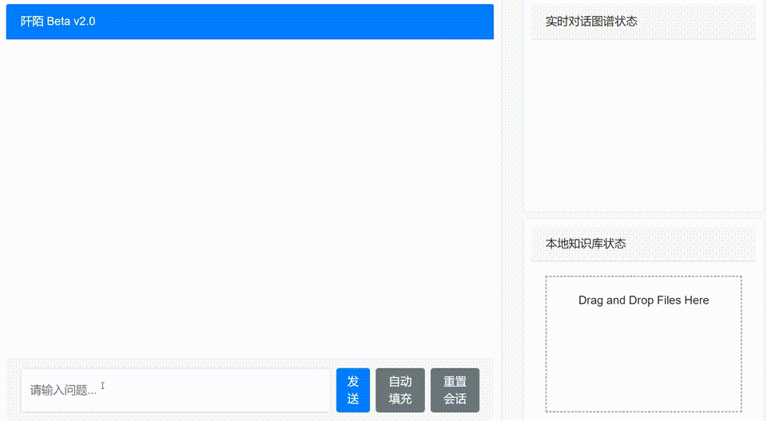

# 领域大模型与知识图谱系统DEMO
# Domain_Large_Models_and_Knowledge_Graph_System_DEMO

## 简介
该仓库用于展示团队目前自研的几款面向不同领域的结合知识图谱和大模型能力的智能系统功能和部分开源代码（REPO将持续更新），目前包括：
- 工程管理垂域大模型**CON-AI**
- 单位知识产权智能管理系统“阡寻”
- 龙华区人民法院域外法查明平台

## 工程管理垂域大模型系统“Con-AI”

依托大模型理解和推理能力，基于检索增强生成（RAG）和工程知识图谱结合，可实现高效信息检索、专业长文档解析与动态生成、简单工具调用（如劳动力排班分析，修改BIM构件参数等）

### 功能介绍

1. 理解查询问题并回答（支持问题缺陷理解和智能提示）

- 演示示例：

- 演示示例：
  
- 演示示例：

2. 输入仅包含标题的空白标书，自动生成填充内容（视频中，以桩基施工部分的技术方案为例，实现包括文字、图片、表格的自动组合生成）

- 演示示例：

3. 本地计算工具自动调用（视频中，调用本地的劳动力需求计算工具，基于输入的工期和工程量等数据，实现劳动力需求分析）

- 演示示例：

4. 基于IFC的BIM模型智能交互（视频中，使用大模型对BIM-IFC数据和用户意图并行解析，并在IFC层实现BIM模型查询和更新）

- 演示示例：[交互分析](uploads/con-AI_high_level_2_refined.mp4)

## 中科院深圳先进院（SIAT）存量知识产权智能管理系统

该系统覆盖中国科学院深圳先进院内部存量专利、论文、获奖、项目信息等多源知识产权信息。系统面向先进院匹配撮合产业市场和院内技术团队效率低的痛点，实现对产业需求描述的精准解析，智能匹配推荐技术团队。

### 功能介绍

技术需求查询→团队匹配度分析→智能咨询交互（视频中，基于“肺病”和“音视频隐私处理和提取”为例子，找到该产业需求在先进院内最匹配的技术团队，支持卡片、图谱等多种展示方式，并实现基于大模型和技术团队的智能交互问答）

- 演示示例：

- 演示示例：

- 演示示例：

## 对深圳龙华区人民法院域外法查明平台

针对法院在处理涉外案件时的多源多语种信息关联困难问题，基于RAG和知识图谱实现法条-案例的语义和法律领域特征变量关联，实现10余国家法条和案例精准检索。该系统已在龙华区法院部署上线，[点击此处](https://www.ywfcmpt.szlhcourt.gov.cn/home)

